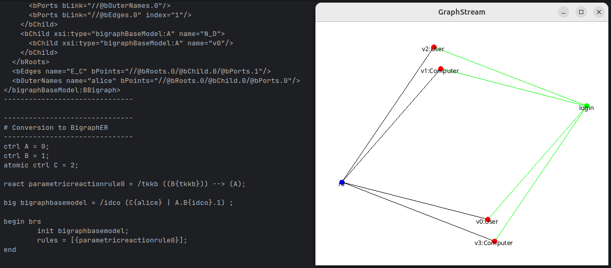

# Quickstart Project Template for Bigraph Framework

This project provides a quick introduction on how to use and include the Bigraph Framework.

This main class `org.example.MainBigraphApplication` creates a signature and two bigraphs first, and performs the following operations afterwards:
- The two bigraphs are composed
- A reactive system is created, a matching conducted and the agent rewritten
- A bigraph is converted to the BigraphER specification language format

**Screenshot**



## Getting Started

This project is best worked with using:
- Open the project in IntelliJ IDEA / Eclipse / Visual Code / ...
- Run the application within the IDE

Alternatively, the application can be built and started from the command line.

The project supports both Maven and Gradle for dependency management and builds.  
The following sections describe how to configure and build the project using either tool.


### Maven

#### Create a Fat-JAR / Uber-JAR

All the dependencies are included in the generated JAR.

```shell
# Create the executable JAR
$ mvn clean package -PfatJar
# Execute the application
$ java -jar ./target/fatJar-empty-project-skeleton-bigraphframework-2.4.0.jar
```

#### Classpath-Approach (1): Relative Libs-Folder

The necessary dependencies are installed in your local Maven repository, and also copied in a local folder next to the 
generated JAR and referred to at runtime.
That is, the classpath in the `MANIFEST.MF` is set to `libs/` (relative to the generated JAR).

```shell
# Create the executable JAR
$ mvn clean install -PlocalLib
# Execute the application
$ java -jar ./target/localLib-empty-project-skeleton-bigraphframework-2.4.0.jar
```

#### Classpath-Approach (2): Local Maven Repository

The necessary dependencies are installed in your local Maven repository, which is where the generated application refers to.
That is, the classpath in the `MANIFEST.MF` is set to `~/.m2/repository/`.

```shell
# Create the executable JAR
$ mvn clean install -PlocalM2
# Execute the application
$ java -jar ./target/localM2-empty-project-skeleton-bigraphframework-2.4.0.jar
```

### Gradle 

Verify that you have Gradle >= 8.4 installed:

```shell
$ gradle -v
```

Run the following command to build the project:
```shell
$ gradle build
```

To run the project:
```shell
$ gradle run
```

**Using the Gradle Wrapper**

You can execute the Gradle build with the help of the Gradle Wrapper.

To use the Gradle Wrapper on a Windows machine for this project:
```shell
$ gradlew.bat build
$ gradlew.bat run
```

On a Linux machine:
```shell
$ ./gradlew build
$ ./gradlew run
```
